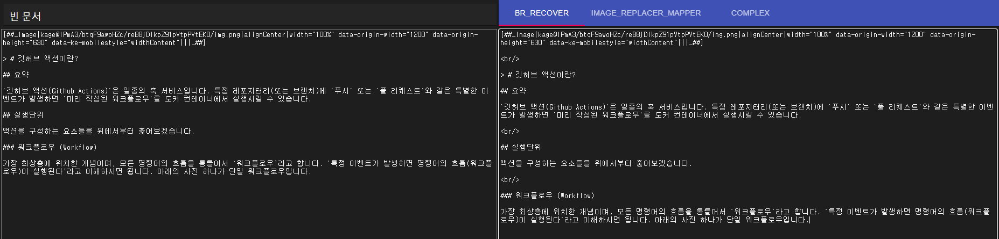
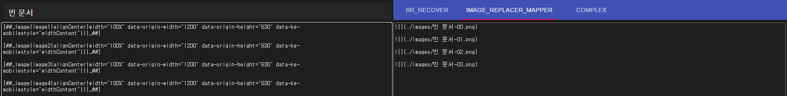

# Tistory Markdown Utils

티스토리 마크다운 모드에서 개행을 하는 방법은 오직 `<br/>`을 이용하는 것 뿐입니다. 하지만 개행을 사용한 마크다운을 다시 수정하려고 하면 `<br/> 태그가 사라지는 이슈`가 발생합니다. 해당 유틸리티는 `손상된 마크다운`을 `정규화된 마크다운`으로 변환합니다.

---

## 실행

### 개발 모드로 실행

자원을 많이 잡아먹지만, 소스가 변경되면 변경점이 바로 적용됩니다.

```bash
$ npm run dev
```

<br/>

### 빌드 모드로 실행

```bash
$ npm run build
$ npm run start
```

<br/>

---

## 기능

### 마크다운 정규화 (이미지 치환자 교체 미포함)

통칭 `BR-RECOVER` 모드입니다. 문서를 이전과 같이 복구하는 것은 사실상 불가능하므로, 미리 정의된 규칙에 따라, 적당한 위치에 `<br/>`태그를 삽입합니다. 단, 이미지 치환자는 건드리지 않습니다.

<br/>

아래 사진에서 왼쪽은 `<br/> 태그가 없는 손상된 문서`이고, 오른쪽이 `정규화된 문서`입니다.



<br/>

### 이미지 치환자 교체

통칭 `IMAGE-REPLACER-MAPPER` 모드입니다. 티스토리 치환자를 `./images/${prefix}xx.png`를 가르키는 마크다운 문법으로 교체합니다. `prefix`는 문서의 이름을 사용합니다.



치환자는 중복되선 안됩니다.

<br/>

### 마크다운 정규화 (이미지 치환자 교체 포함)

통칭 `COMPLEX` 모드입니다. 티스토리 게시글의 내용을 깃허브에 올리고 싶을 때 사용하며, 구체적으로 다음과 같이 동작합니다.

1. `IMAGE-REPLACER-MAPPER`로 이미지 치환자 교체
2. `BR-RECOVER`로 정규화
